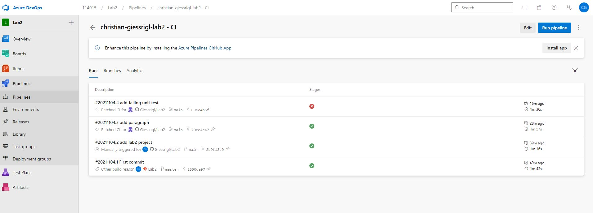
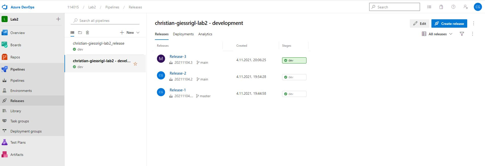
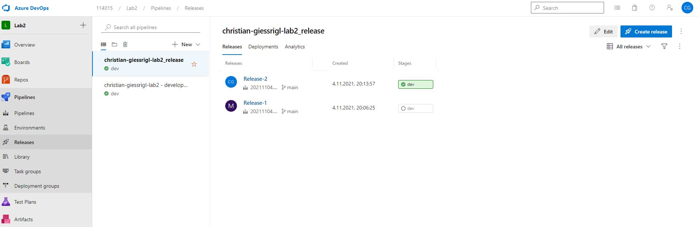
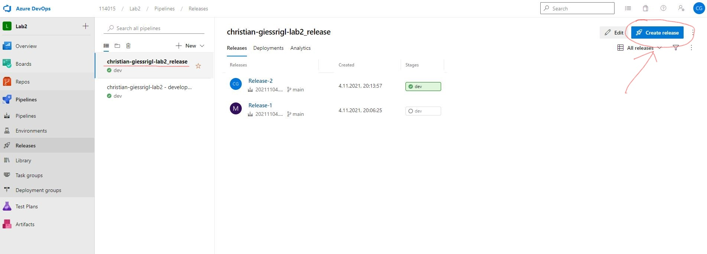
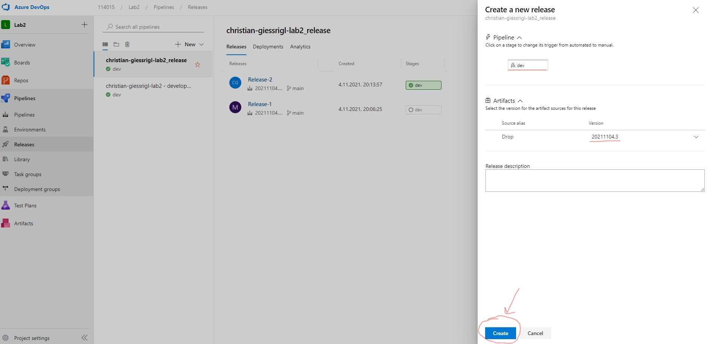
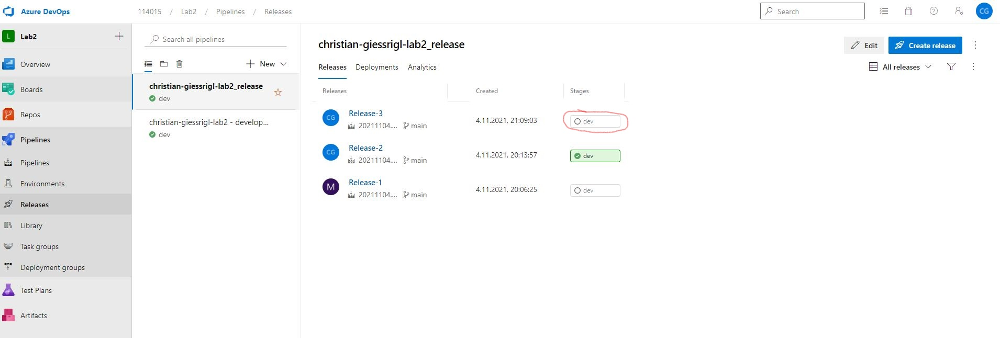
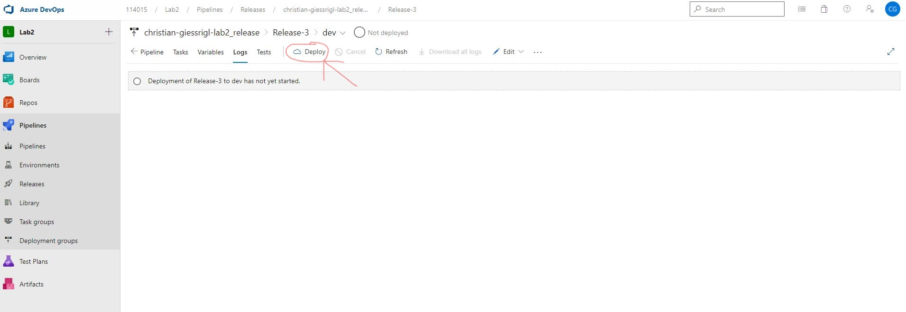
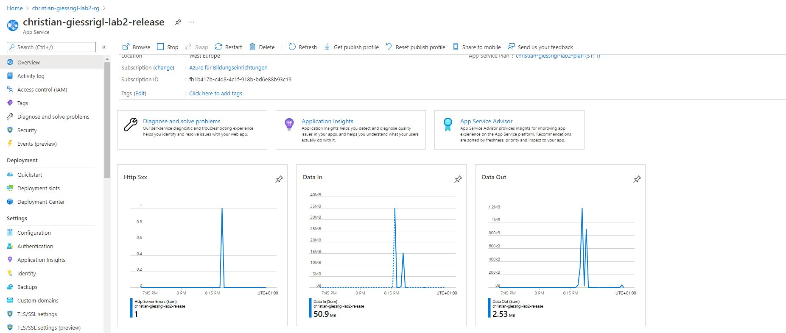

# Lab2
## Link zu dem in Azure DevOps verwendeten Repo der Node.js App
https://github.com/Giessrigl/Lab2

## Links zu Web App
### Dev
https://christian-giessrigl-lab2.azurewebsites.net/
### Production
https://christian-giessrigl-lab2-release.azurewebsites.net/

## Screenshot der Azure DevOps build/Test/Deploy Pipeline incl.  erfolgreicher und nicht erfolgreicher Deployments

## Screenshot der Azure DevOps Release Pipeline
### Dev

### Production

## Dokumentation wie die Releases freigegeben werden

Auf dev.azure.com im production release oben rechts auf Create Release drücken.

Damit öffnet sich ein neues Fenster in dem man bestimmen kann welche Drop Version released werden soll.

Anschließend muss das Deployment noch genehmigt werden. 
Dafür muss auf den ausgegrauten Knopf in der Spalte ,,Stages" gedrückt werden.

Im nächsten Bildschirm dann oben auf Deploy klicken. Fertig.

## Application Insights

