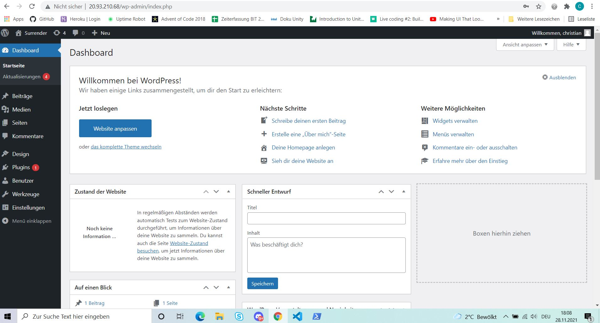
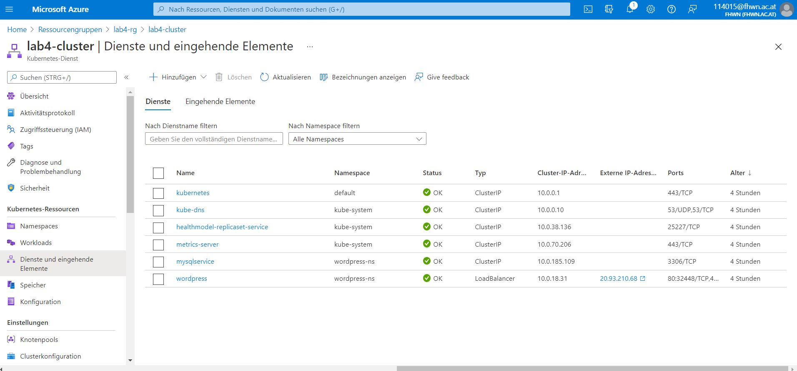

# Lab 4
## Followed following guides/ tutorials:
[Microsoft Kubernetes Walkthrough](https://docs.microsoft.com/en-us/azure/aks/kubernetes-walkthrough)

[Set up WP + MySQL in AKS](https://quisl.de/b/wie-du-wordpress-auf-azure-kubernetes-services-installierst-manuelles-deployment-in-6-schritten/)

## Annotations
If you want to use kubectl commands you have to change the [Namespace](https://kubernetes.io/docs/concepts/overview/working-with-objects/namespaces/) (defined in the namespace.yaml, in this case: wordpress-ns)

## Applied the following changes:

* Ignored the Ingress Controller in [Set up WP + MySQL in AKS](https://quisl.de/b/wie-du-wordpress-auf-azure-kubernetes-services-installierst-manuelles-deployment-in-6-schritten/)
* Also ignored the .password.txt and changed it to static passwords in the .yaml files where needed.

* I added some environment variables described in the images dokumentation ([MySQL](https://hub.docker.com/_/mysql) & [Wordpress](https://hub.docker.com/_/wordpress).

* Used the .bat script in 6th step for deployment in AKS without the lines for the ingress-controller-yaml and the .password.txt and run it in Powershell after:
1. az login
2. az aks get-credentials --resource-group {RG_Name} --name {Cluter_Name}
3. cd {Directory of the files with the .bat script}
4. ./deploy.bat

* To create an external ip address for the wordpress website I had to switch the wordpress service from ClusterIP to LoadBalancer found in this forum discussion:
https://stackoverflow.com/questions/64122513/aks-cluster-created-has-no-external-ip-address

* Lastly I could not establish a database connection when setting up wordpress.
Things I tried:
1. Use a static cluster ip address in services.yaml instead of "None".
2. Use an internal LoadBalancer instead of ClusterIP as type -> [Internal lb](https://docs.microsoft.com/en-us/azure/aks/internal-lb) and connect wordpress to the "external ip address" of mysql.
3. Use the on-installation-created database for the Database Name to connect to (in the wordpressdeployment.yaml).
4. Changed the mysql version (from 5.7 to 5.6) after a colleague explained the possibility of the mysql version not being compatible with the volume for the AKS.

After identifying the problem (pod could not start because of the volume definition in mysqldeployment.yaml) I commented out the volume definition. I haven't found a solution.

## Screenshots

